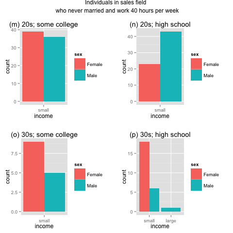

<h1>Analysis of Income and Gender</h1>

<h2>Introduction</h2>
On September 17, 2013, the Huffington Post published a controversial article titled <a href='http://www.huffingtonpost.com/2013/09/17/gender-wage-gap_n_3941180.html' target='_blank'>Women Still Earned 77 Cents On Men's Dollar In 2012: Report</a>. The article drew a multitude of criticisms from people (mostly men) who strongly voiced that gender discrimination didn't exist or that the income disparity arose from various factors, such as women working less hours, women taking more leaves, their unwillingness to take on more lucrative but also demanding jobs (long hours, physically intensive, irregular schedule), and their inferior salary negotiation skills. 

While I didn't personally think that women had "inferior negotiation skills" than men, I was interested in the topic and decided to conduct my own data analysis and see if income gap existed between men and women when compared under equal conditions. For the purpose of this analysis, I decided to compare individuals who have never married.

<h2>Methods</h2>
<h3>Tool</h3>
This analysis was performed using the <a href='http://www.R-project.org' target='_blank'>R programming language</a>.

<h3>About the Data</h3>
The <strong>AdultUCI</strong> dataset in <strong>arules</strong> package in R contains information about individuals' information from census data. Information about individuals include age, education, marital status, occupation, relationship, race, sex, work hours per week, native country, income, etc. Income is classified as either 'small' (less than $50K/year salary) or 'large' (greater than or equal to $50K/year).

CRAN package URL: <a href='http://cran.r-project.org/web/packages/arules/index.html' target='_blank'>http://cran.r-project.org/web/packages/arules/index.html</a>

** Note that the dataset does not provide the actual salaries of the sample individuals. Instead, it only reports whether the individuals' income is 'large' (greater than or equal to $50K/year) or 'small' (less than $50K/year).

<h3>Processing the Data</h3>
<strong>AdultUCI</strong> data (a processed version of census income data) was further processed for the following reasons: 
<ol>
	<li>To eliminate any rows with missing values.</li>
	<li>To rename the column names by removing - characters and replacing with _ characters.</li>
	<li>To add a new column, <strong>age_group</strong> (in addition to the <strong>age</strong> column).</li>
</ol>

The final dataset for the analysis was stored inside the <a href='./data' target='_blank'>data</a> folder as <a href='./data/incomeData.RData' target='_blank'>incomeData.RData</a>. 

The script used to process the <strong>AdultUCI</strong> data can be seen <a href='./scripts/init.R' target='_blank'>here</a>.

<h3>Individuals' Data Selection: Subsetting</h3>
For the purpose of this analysis, I decided to analyze individuals who have never been married before. 

Below R code was used to load the pre-processed <strong>AdultUCI</strong> data and subset males and females who have never been married.

    > load('./data/incomeData.RData')  # load pre-processed data
    > m.never_married <- subset(incomeData, sex=='Male' & marital_status=='Never-married')  # select all males who never married
    > f.never_married <- subset(incomeData, sex=='Female' & marital_status=='Never-married')  # select all females who never married
    > mf.never_married <- rbind(m.never_married, f.never_married)  # select all males and females who never married

<h3>Statistical Methods Used</h3>
<ul>
	<li>Chi-square test</li>
	<li>Fisher's exact test</li>
	<li>Mann-Whitney U test</li>
	<li>Levene's test</li>
</ul>

<h2>Results</h2>
<strong>Note:</strong> "Men and women" from here and on refer to individuals who have never married.

<h3>Sample sizes</h3>
After subsetting for individuals who have never married, there were more men (5414) than women (4312) in the dataset. 
 

<h3>Age difference between genders</h3>
There didn't appear to be any significant age difference between men and women in the dataset.

Average age of men who never married: 28.4 
Average age of women who never married: 28.5 
Median age of men who never married: 26 
Median age of women who never married: 25 

 
 

Mann-Whitney U test (a non-parametric median comparison test) was performed to see if the median age difference between men and women was significant. The test rendered a p-value of 0.162 (greater than 0.05), which allowed me to retain the null hypothesis and conclude that there exists no statistically significant difference in average age between men and women.

<h3>Work hours per week by gender</h3>
There appeared to be some noteable difference in the number of work hours per week between men and women.

Average work hours per week for men who have never married: 38.7 
Average work hours per week for women who have never married: 35.3 
Median work hours per week for men who have never married: 40 
Median work hours per week for women who have never married: 40 

 

Mann-Whitney U test (a non-parametric median comparison test) was performed to see if the difference between men and women's work hours per week was statistically significant. The test rendered a p-value less than 2.2e-16 (much, much less than 0.05), which allowed me to conclude that there exists a statistically significant difference in the number of work hours per week between men and women (that men tend to work longer hours than women).

<h3>Education by gender</h3>
There appeared to be some noteable difference in the average number in school between men and women.

Average number of years in school for men who have never married: 9.8 
Average number of years in school for women who have never married: 10.3 
Median number of years in school for men who have never married: 10 
Median number of years in school for women who have never married: 10 

Mann-Whitney U test (a non-parametric median comparison test) was performed to see if the difference between men and women's number of years in school was statistically significant. The test rendered a p-value less than 2.2e-16 (much, much less than 0.05), which allowed me to conclude that there exists a statistically significant difference in the number of years in school between men and women (and that women tend to stay longer in school).

<h3>Occupation by gender</h3>
 

<h3>Comparing men and women under fixed conditions I</h3>
Men and women's income levels (large or small) were counted after fixing the following variables: 
<ul>
	<li>age group</li>
	<li>number of work hours per week</li>
	<li>occupational field</li>
	<li>educational background (highest education)</li>
</ul>

<h5>Individuals in executive/managerial field who never married and worked 40 hours per week</h5>
 

<table>
	<tr>
		<th></th>
		<th colspan="2">(a)</th>
		<th colspan="2">(b)</th>
		<th colspan="2">(c)</th>
		<th colspan="2">(d)</th>
	</tr>
	<tr>
		<td></td>
		<td colspan="2">p = 0.439</td>
		<td colspan="2">p = 1</td>
		<td colspan="2">p = 1</td>
		<td colspan="2">p = 1</td>
	</tr>
	<tr>
		<td></td>
		<td>Female</td>
		<td>Male</td>
		<td>Female</td>
		<td>Male</td>
		<td>Female</td>
		<td>Male</td>
		<td>Female</td>
		<td>Male</td>
	</tr>
	<tr>
		<td>small</td>
		<td>17</td>
		<td>23</td>
		<td>19</td>
		<td>14</td>
		<td>11</td>
		<td>12</td>
		<td>10</td>
		<td>5</td>
	</tr>
	<tr>
		<td>large</td>
		<td>1</td>
		<td>0</td>
		<td>0</td>
		<td>0</td>
		<td>0</td>
		<td>1</td>
		<td>0</td>
		<td>0</td>
	</tr>
</table>

All four sub-groups (a, b, c, d) displayed p-values greater than 0.05. Therefore, I retained the null hypothesis that there is no difference in the proportions of 'large' income-earners (more than $50K/year) between men and women among individuals working in executive/managerial field who never married, worked 40 hours per week, and:
<ul>
	<li>were in their 20s and had attended college (no degree), p > 0.05, (a)</li>
	<li>were in their 20s and had graduated from high school, p > 0.05, (b)</li>
	<li>were in their 30s and had attended college (no degree), p > 0.05, (c)</li>
	<li>were in their 30s and had graduated from high school, p > 0.05, (d)</li>
</ul>

<h5>Individuals in other service field who never married and worked 40 hours per week</h5>
 

<table>
	<tr>
		<th></th>
		<th colspan="2">(e)</th>
		<th colspan="2">(f)</th>
		<th colspan="2">(g)</th>
		<th colspan="2">(h)</th>
	</tr>
	<tr>
		<td></td>
		<td colspan="2">p = 1</td>
		<td colspan="2">p = 1</td>
		<td colspan="2">p = 1</td>
		<td colspan="2">p = 1</td>
	</tr>
	<tr>
		<td></td>
		<td>Female</td>
		<td>Male</td>
		<td>Female</td>
		<td>Male</td>
		<td>Female</td>
		<td>Male</td>
		<td>Female</td>
		<td>Male</td>
	</tr>
	<tr>
		<td>small</td>
		<td>38</td>
		<td>36</td>
		<td>56</td>
		<td>65</td>
		<td>13</td>
		<td>12</td>
		<td>32</td>
		<td>33</td>
	</tr>
	<tr>
		<td>large</td>
		<td>1</td>
		<td>0</td>
		<td>0</td>
		<td>0</td>
		<td>0</td>
		<td>0</td>
		<td>0</td>
		<td>0</td>
	</tr>
</table>

All four sub-groups (e, f, g, h) displayed p-values greater than 0.05. Therefore, I retained the null hypothesis that there is no difference in the proportions of 'large' income-earners (more than $50K/year) between men and women among individuals working in other service field who never married, worked 40 hours per week, and:
<ul>
	<li>were in their 20s and had attended college (no degree), p > 0.05, (e)</li>
	<li>were in their 20s and had graduated from high school, p > 0.05, (f)</li>
	<li>were in their 30s and had attended college (no degree), p > 0.05, (g)</li>
	<li>were in their 30s and had graduated from high school, p > 0.05, (h)</li>
</ul>

<h5>Individuals in professional specialty field who never married and worked 40 hours per week</h5>
 

<table>
	<tr>
		<th></th>
		<th colspan="2">(i)</th>
		<th colspan="2">(j)</th>
		<th colspan="2">(k)</th>
		<th colspan="2">(l)</th>
	</tr>
	<tr>
		<td></td>
		<td colspan="2">p = 1</td>
		<td colspan="2">p = 1</td>
		<td colspan="2">p = 1</td>
		<td colspan="2">p = 1</td>
	</tr>
	<tr>
		<td></td>
		<td>Female</td>
		<td>Male</td>
		<td>Female</td>
		<td>Male</td>
		<td>Female</td>
		<td>Male</td>
		<td>Female</td>
		<td>Male</td>
	</tr>
	<tr>
		<td>small</td>
		<td>11</td>
		<td>13</td>
		<td>11</td>
		<td>10</td>
		<td>5</td>
		<td>6</td>
		<td>1</td>
		<td>5</td>
	</tr>
	<tr>
		<td>large</td>
		<td>0</td>
		<td>1</td>
		<td>1</td>
		<td>0</td>
		<td>0</td>
		<td>1</td>
		<td>0</td>
		<td>1</td>
	</tr>
</table>

All four sub-groups (i, j, k, l) displayed p-values greater than 0.05. Therefore, I retained the null hypothesis that there is no difference in the proportions of 'large' income-earners (more than $50K/year) between men and women among individuals working in professional specialty field who never married, worked 40 hours per week, and:
<ul>
	<li>were in their 20s and had attended college (no degree), p > 0.05, (i)</li>
	<li>were in their 20s and had graduated from high school, p > 0.05, (j)</li>
	<li>were in their 30s and had attended college (no degree), p > 0.05, (k)</li>
	<li>were in their 30s and had graduated from high school, p > 0.05, (l)</li>
</ul>

<h5>Individuals in sales field who never married and worked 40 hours per week</h5>
 

<table>
	<tr>
		<th></th>
		<th colspan="2">(m)</th>
		<th colspan="2">(n)</th>
		<th colspan="2">(o)</th>
		<th colspan="2">(p)</th>
	</tr>
	<tr>
		<td></td>
		<td colspan="2">p = 1</td>
		<td colspan="2">p = 1</td>
		<td colspan="2">p = 1</td>
		<td colspan="2">p = 0.28</td>
	</tr>
	<tr>
		<td></td>
		<td>Female</td>
		<td>Male</td>
		<td>Female</td>
		<td>Male</td>
		<td>Female</td>
		<td>Male</td>
		<td>Female</td>
		<td>Male</td>
	</tr>
	<tr>
		<td>small</td>
		<td>39</td>
		<td>36</td>
		<td>23</td>
		<td>43</td>
		<td>9</td>
		<td>5</td>
		<td>18</td>
		<td>6</td>
	</tr>
	<tr>
		<td>large</td>
		<td>0</td>
		<td>0</td>
		<td>0</td>
		<td>0</td>
		<td>0</td>
		<td>0</td>
		<td>0</td>
		<td>1</td>
	</tr>
</table>

All four sub-groups (m, n, o, p) displayed p-values greater than 0.05. Therefore, I retained the null hypothesis that there is no difference in the proportions of 'large' income-earners (more than $50K/year) between men and women among individuals working in sales field who never married, worked 40 hours per week, and:
<ul>
	<li>were in their 20s and had attended college (no degree), p > 0.05, (m)</li>
	<li>were in their 20s and had graduated from high school, p > 0.05, (n)</li>
	<li>were in their 30s and had attended college (no degree), p > 0.05, (o)</li>
	<li>were in their 30s and had graduated from high school, p > 0.05, (p)</li>.
</ul>

<h3>Comparing men and women under fixed conditions II</h3>
Men and women's income levels (large or small) were counted after fixing the following variables: 
<ul>
	<li>age group</li>
	<li>number of work hours per week</li>
	<li>occupational field</li>
</ul>

The following variable was not fixed:
<ul>
	<li>educational background (highest education)</li>
</ul>

<h5>Individuals in executive/managerial field who never married and worked 40 hours per week</h5>
 

<table>
	<tr>
		<th></th>
		<th colspan='2'>(q)</th>
		<th colspan='2'>(r)</th>
	</tr>
	<tr>
		<td></td>
		<td colspan='2'>p = 0.6209</td>
		<td colspan='2'>p = 0.03211</td>
	</tr>
	<tr>
		<td></td>
		<td>Female</td>
		<td>Male</td>
		<td>Female</td>
		<td>Male</td>
	</tr>
	<tr>
		<td>small</td>
		<td>89</td>
		<td>89</td>
		<td>55</td>
		<td>45</td>
	</tr>
	<tr>
		<td>large</td>
		<td>3</td>
		<td>1</td>
		<td>4</td>
		<td>12</td>
	</tr>
</table>

Fisher's exact test performed on the 30s group (r) resulted in a p-value of 0.03211 (less than 0.05). Therefore, I rejected the null hypothesis and concluded that there is a statistically significant difference in the proportions of 'large' income-earners (more than $50K/year) between men and women (in favor of men) among individuals in their 30s working in executive/managerial field who never married and worked 40 hours per week when there exists no fix for educational background.

<h5>Individuals in other service field who never married and worked 40 hours per week</h5>
 

<table>
	<tr>
		<th></th>
		<th colspan='2'>(s)</th>
		<th colspan='2'>(t)</th>
	</tr>
	<tr>
		<td></td>
		<td colspan='2'>p = 0.4667</td>
		<td colspan='2'>p = 1</td>
	</tr>
	<tr>
		<td></td>
		<td>Female</td>
		<td>Male</td>
		<td>Female</td>
		<td>Male</td>
	</tr>
	<tr>
		<td>small</td>
		<td>125</td>
		<td>144</td>
		<td>65</td>
		<td>69</td>
	</tr>
	<tr>
		<td>large</td>
		<td>1</td>
		<td>0</td>
		<td>0</td>
		<td>0</td>
	</tr>
</table>

Both sub-groups displayed p-values greater than 0.05. Therefore, I retained the null hypothesis that there is no difference in the proportions of 'large' income-earners (more than $50K/year) between men and women among individuals working in other service field who never married, worked 40 hours per week, and:
<ul>
	<li>were in their 20s, p > 0.05, (s)</li>
	<li>were in their 30s, p > 0.05, (t)</li>
</ul>
 
<h5>Individuals in professional specialty field who never married and worked 40 hours per week</h5>
 

<table>
	<tr>
		<th></th>
		<th colspan='2'>(u)</th>
		<th colspan='2'>(v)</th>
	</tr>
	<tr>
		<td></td>
		<td colspan='2'>p = 0.4381</td>
		<td colspan='2'>p = 0.0003111</td>
	</tr>
	<tr>
		<td></td>
		<td>Female</td>
		<td>Male</td>
		<td>Female</td>
		<td>Male</td>
	</tr>
	<tr>
		<td>small</td>
		<td>134</td>
		<td>102</td>
		<td>73</td>
		<td>56</td>
	</tr>
	<tr>
		<td>large</td>
		<td>11</td>
		<td>5</td>
		<td>4</td>
		<td>20</td>
	</tr>
</table>

Fisher's exact test performed on the 30s group (v) resulted in a p-value of 0.0003111 (less than 0.05). Therefore, I rejected the null hypothesis and concluded that there is a statistically significant difference in the proportions of 'large' income-earners (more than $50K/year) between men and women (in favor of men) among individuals in their 30s working in professional specialty field who never married and worked 40 hours per week when there exists no fix for educational background.

<h5>Individuals in sales field who never married and worked 40 hours per week</h5>
 

<table>
	<tr>
		<th></th>
		<th colspan='2'>(w)</th>
		<th colspan='2'>(x)</th>
	</tr>
	<tr>
		<td></td>
		<td colspan='2'>p = 0.5022</td>
		<td colspan='2'>p = 0.007476</td>
	</tr>
	<tr>
		<td></td>
		<td>Female</td>
		<td>Male</td>
		<td>Female</td>
		<td>Male</td>
	</tr>
	<tr>
		<td>small</td>
		<td>108</td>
		<td>128</td>
		<td>49</td>
		<td>28</td>
	</tr>
	<tr>
		<td>large</td>
		<td>0</td>
		<td>2</td>
		<td>1</td>
		<td>7</td>
	</tr>
</table>

Fisher's exact test performed on the 30s group (x) resulted in a p-value of 0.007476 (less than 0.05). Therefore, I rejected the null hypothesis and concluded that there is a statistically significant difference in the proportions of 'large' income-earners (more than $50K/year) between men and women (in favor of men) among individuals in their 30s working in sales field who never married and worked 40 hours per week when there exists no fix for educational background.

<h3>Comparing men and women under fixed conditions III</h3>
Men and women's income levels (large or small) were counted after fixing the following variables: 
<ul>
	<li>age group</li>
	<li>occupational field</li>
</ul>

The following variables were not fixed:
<ul>
	<li>number of work hours per week</li>
	<li>educational background (highest education)</li>
</ul>

<h5>Individuals in executive/managerial field who never married</h5>
 

<table>
	<tr>
		<th></th>
		<th colspan='2'>(y)</th>
		<th colspan='2'>(z)</th>
	</tr>
	<tr>
		<td></td>
		<td colspan='2'>p = 0.26</td>
		<td colspan='2'>p = 0.08727</td>
	</tr>
	<tr>
		<td></td>
		<td>Female</td>
		<td>Male</td>
		<td>Female</td>
		<td>Male</td>
	</tr>
	<tr>
		<td>small</td>
		<td>176</td>
		<td>177</td>
		<td>96</td>
		<td>97</td>
	</tr>
	<tr>
		<td>large</td>
		<td>6</td>
		<td>12</td>
		<td>15</td>
		<td>29</td>
	</tr>
</table>

Both sub-groups displayed p-values greater than 0.05. Therefore, I retained the null hypothesis that there is no difference in the proportions of 'large' income-earners (more than $50K/year) between men and women among individuals working in executive/managerial field who never married and:
<ul>
	<li>were in their 20s, (y)</li>
	<li>were in their 30s, (z)</li>
</ul>

<h5>Individuals in other service field who never married</h5>
 

<table>
	<tr>
		<th></th>
		<th colspan='2'>(aa)</th>
		<th colspan='2'>(ab)</th>
	</tr>
	<tr>
		<td></td>
		<td colspan='2'>p = 0.7146</td>
		<td colspan='2'>p = 1</td>
	</tr>
	<tr>
		<td></td>
		<td>Female</td>
		<td>Male</td>
		<td>Female</td>
		<td>Male</td>
	</tr>
	<tr>
		<td>small</td>
		<td>390</td>
		<td>364</td>
		<td>141</td>
		<td>127</td>
	</tr>
	<tr>
		<td>large</td>
		<td>3</td>
		<td>2</td>
		<td>1</td>
		<td>0</td>
	</tr>
</table>

Both sub-groups displayed p-values greater than 0.05. Therefore, I retained the null hypothesis that there is no difference in the proportions of 'large' income-earners (more than $50K/year) between men and women among individuals working in other service field who never married and:
<ul>
	<li>were in their 20s, p > 0.05, (aa)</li>
	<li>were in their 30s, p > 0.05, (ab)</li>
</ul>
 
<h5>Individuals in professional specialty field who never married</h5>
 

<table>
	<tr>
		<th></th>
		<th colspan='2'>(ac)</th>
		<th colspan='2'>(ad)</th>
	</tr>
	<tr>
		<td></td>
		<td colspan='2'>p = 0.1283</td>
		<td colspan='2'>p = 0.01119</td>
	</tr>
	<tr>
		<td></td>
		<td>Female</td>
		<td>Male</td>
		<td>Female</td>
		<td>Male</td>
	</tr>
	<tr>
		<td>small</td>
		<td>308</td>
		<td>241</td>
		<td>138</td>
		<td>125</td>
	</tr>
	<tr>
		<td>large</td>
		<td>14</td>
		<td>20</td>
		<td>25</td>
		<td>47</td>
	</tr>
</table>
Chi-square test performed on the 30s group (ad) resulted in a p-value of 0.01119 (less than 0.05). Therefore, I rejected the null hypothesis and concluded that there is a statistically significant difference in the proportions of 'large' income-earners (more than $50K/year) between men and women (in favor of men) among individuals in their 30s working in professional specialty field who never married when there exists no fix for educational background or the number of hours worked.

<h5>Individuals in sales field who never married</h5>
 

<table>
	<tr>
		<th></th>
		<th colspan='2'>(ae)</th>
		<th colspan='2'>(af)</th>
	</tr>
	<tr>
		<td></td>
		<td colspan='2'>p = 0.001935</td>
		<td colspan='2'>p = 0.00316</td>
	</tr>
	<tr>
		<td></td>
		<td>Female</td>
		<td>Male</td>
		<td>Female</td>
		<td>Male</td>
	</tr>
	<tr>
		<td>small</td>
		<td>320</td>
		<td>341</td>
		<td>93</td>
		<td>93</td>
	</tr>
	<tr>
		<td>large</td>
		<td>1</td>
		<td>13</td>
		<td>5</td>
		<td>21</td>
	</tr>
</table>

Fisher's exact test performed on the 20s group (ae) and the 30s group (af) resulted in p-values of 0.001935 and 0.00316, respectively (both less than 0.05). Therefore, I rejected the null hypothesis and concluded that there is a statistically significant difference in the proportions of 'large' income-earners (more than $50K/year) between men and women (both in favor of men) among individuals in their 20s and 30s working in sales field who never married when there exists no fix for educational background or the number of hours worked.

<h3>Comparing men and women under fixed conditions IV</h3>
Men and women's income levels (large or small) were counted after fixing the following variable: 
<ul>
	<li>occupational field</li>
</ul>

The following variables were not fixed:
<ul>
	<li>age group</li>
	<li>number of work hours per week</li>
	<li>educational background (highest education)</li>
</ul>

<h5>Individuals who never married</h5>
 

<table>
	<tr>
		<th></th>
		<th colspan='2'>(ag)</th>
		<th colspan='2'>(ah)</th>
		<th colspan='2'>(ai)</th>
		<th colspan='2'>(aj)</th>
	</tr>
	<tr>
		<td></td>
		<td colspan='2'>p = 0.01027</td>
		<td colspan='2'>p = 0.568</td>
		<td colspan='2'>p = 0.0006787</td>
		<td colspan='2'>p = 8.112e-08</td>
	</tr>
	<tr>
		<td></td>
		<td>Female</td>
		<td>Male</td>
		<td>Female</td>
		<td>Male</td>
		<td>Female</td>
		<td>Male</td>
		<td>Female</td>
		<td>Male</td>
	</tr>
	<tr>
		<td>small</td>
		<td>343</td>
		<td>328</td>
		<td>830</td>
		<td>766</td>
		<td>578</td>
		<td>457</td>
		<td>667</td>
		<td>565</td>

	</tr>
	<tr>
		<td>large</td>
		<td>42</td>
		<td>70</td>
		<td>5</td>
		<td>7</td>
		<td>71</td>
		<td>100</td>
		<td>10</td>
		<td>48</td>
	</tr>
</table>

Fisher's exact test performed on the executive/managerial group (ae) and chi-square tests performed on the professional specialty group (ai) and the sales group (aj) resulted in p-value of 0.01027, 0.0006787, and 8.112e-08, respectively (all less than 0.05). Therefore, I rejected the null hypothesis and concluded that there is a statistically significant difference in the proportions of 'large' income-earners (more than $50K/year) between men and women (all three in favor of men) among individuals working in executive/managerial, professional specialty, and sales field when there exists no fix for age group, educational background, or the number of hours worked.

<h2>Conclusion</h2>
When men and women were compared after fixing for marital status (never married), age group, occupational field, number of hours worked, and educational background, there seemed to be no difference in the proportions of 'large' income-earners (more than $50K/year) between men and women in all 16 comparisons (a, b, c, d, e, f, g, h, i, j, k, l, m, n, o, p).

When men and women were compared after fixing for marital status (never married), age group, occupational field and number of hours worked but not for educational background, there were three out of eight comparisons (r, v, x) that showed statistically significant differences in the proportions of 'large' income-earners (more than $50K/year) between men and women.

When men and women were compared after fixing for marital status (never married), age group, and occupational field but not for number of hours worked or educational background, there were three out of eight comparisons (ad, ae, af) that showed statistically significant differences in the proportions of 'large' income-earners (more than $50K/year) between men and women.

When men and women were compared after fixing for only marital status and occupational field, there existed statistically significant differences in the proportions of 'large' income-earners (more than $50K/year) between men and women in all four comparisons (ag, ah, ai, aj) among never-married individuals working in executive/managerial, other service, professional specialty, and sales field.

This suggests that the differences in the proportions of 'large' income-earners arise when individuals are compared without fixing for variables that are related to their pay. When men and women's income are counted and compared after adjusting for individuals' marital status, occupational field, age group, educational background, and number of work hours per week, there didn't appear to be any statistically significant differences in the proportions of 'large' income-earners between men and women. 

<h2>Considerations for Further Analysis</h2>
For future analysis, it would be great to use a dataset that contains individuals' actual income (as opposed to a binary variable that classifies income as either 'large' or 'small'). In addition, 

I would also like to examine individuals in other marital status categories (e.g. married to civilian, divorced, etc.) to see if the same no income proportional differences are observed when occupational field, age group, number of work hours per week, and educational background variables are fixed.

Lastly, the basis for claiming that there existed no statistically significant difference in the proportions of 'large' income-earner (more than $50K/year) between men and women with fixed variables (marital status, occupational field, number of work hours per week, age group, and educational background) relied on Fisher's exact tests conducted on figures (a) through (p). Unfortunately, many of those cases contained cell counts less than or equal to 5, which forced me to perform Fisher's exact tests as opposed to chi-square tests, which are deemed more accurate. In fact, in all 16 cases from (a) through (p), the cells counts for 'large' income-earner counts were either 0 or 1 (mostly 0s). The analysis would have been much more robust if all of the 'large' income-earner counts were greater than 5 and if I could have performed chi-square tests that yielded the same no income proportionality differences between genders. Hence, for the next analysis, it would be great to either focus on sample subsets that can yield higher numbers of 'large' income-earners after fixing for variables or use a much bigger dataset.

